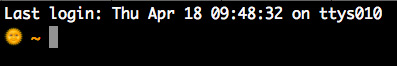

💪💪Bashmoji💪💪
=================

Displays an emoji based on the time of day (OS X).

Borrows heavily from the very fun https://github.com/paulsm/bashtime

Include it in your PS1 variable bruv

    export PS1="\$(/PATH/TO/bashmoji.sh) \w "

Will look something like:

